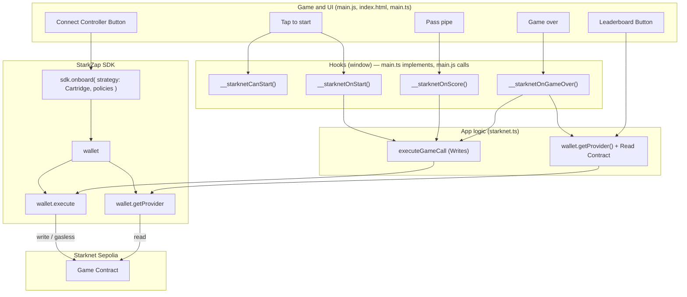

# Floppy Bird × Starknet (StarkZap SDK)

This example **forks [nebez/floppybird](https://github.com/nebez/floppybird)** (implementation and assets) and adds **StarkZap SDK** + **Cartridge Controller** for on-chain score and leaderboard. Each user is assigned a Starknet account via the Cartridge Controller. The score of each user is recorded on Starknet. Connect with Cartridge (social login / passkey), play the original Floppy Bird game, and your score is recorded on Starknet Sepolia with gasless transactions.

## Docs

- [StarkZap Overview](https://docs.starknet.io/build/starkzap) — SDK intro and architecture  
- [Quick Start](https://docs.starknet.io/build/starkzap/quick-start) — First wallet integration  
- [Cartridge Controller](https://docs.starknet.io/build/starkzap/integrations/cartridge-controller) — Gaming wallet and gasless policies  
- [Examples](https://docs.starknet.io/build/starkzap/examples) — Web, mobile, server examples  

## Deploy to Vercel (live demo)

This repo is a **fork of [keep-starknet-strange/starkzap](https://github.com/keep-starknet-strange/starkzap)**. The flappy-bird example depends on the parent SDK (`starkzap`) via `file:../..`, so the **entire monorepo** must be in the repo you deploy from. The SDK is published on npm as [`starkzap`](https://www.npmjs.com/package/starkzap); for a standalone clone you can use that instead of `file:../..`. Use one of these flows to deploy.

### Deploy from this fork

1. **Commit and push** the flappy-bird example and Vercel config from your local clone:

```bash
cd /path/to/repo   # monorepo root 
git add examples/flappy-bird
git commit -m "Add flappy-bird example and Vercel config"
git push origin main
```

2. In [Vercel](https://vercel.com/new), **import** [github.com/username/your-repo]
3. Set **Root Directory** to `examples/flappy-bird`.
4. In **Build & Development Settings** set **Install Command** to:  
   `cd ../.. && npm install && cd examples/flappy-bird && npm install`  
   (**Build:** `npm run build`, **Output:** `dist` — or rely on `vercel.json` in this folder.)
5. Deploy. Your live demo will be at e.g. `https://your-project.vercel.app`.

```bash
git remote add demo https://github.com/YOUR_USERNAME/REPO_NAME.git
# or: git remote set-url origin https://github.com/YOUR_USERNAME/REPO_NAME.git
git push -u demo main
```

3. In Vercel, import that repo, set **Root Directory** to **`examples/flappy-bird`**, and use the same **Install Command** as above.

The `vercel.json` in this folder is set up for this install/build flow when Root Directory is `examples/flappy-bird`.

---

## Run locally

```bash
cd examples/flappy-bird
npm install
npm run dev
```

Open the URL shown in the terminal (e.g. **`https://localhost:5173`**). Click **Connect Controller**, sign in with Cartridge, then tap or press Space to play. Each pipe you pass increments your score on-chain (sponsored by Cartridge).

### HTTPS required for Cartridge Controller

The **Cartridge Controller** (social login / passkey) only works in a **secure context**, so you must use **HTTPS** when testing locally. The dev server is already configured for HTTPS:

- **`npm run dev`** starts Vite with **HTTPS** using [@vitejs/plugin-basic-ssl](https://www.npmjs.com/package/@vitejs/plugin-basic-ssl), which generates a **self-signed certificate** for `localhost`.
- Open **`https://localhost:5173`** (note `https`, not `http`).
- Your browser will show a security warning because the cert is self-signed (e.g. "Your connection is not private"). Use **"Advanced"** → **"Proceed to localhost"** (or the equivalent) to continue. This is safe for local development only.
- After accepting, the Cartridge connect popup and game will work as expected.

**Passkeys (WebAuthn):** Browsers block WebAuthn on sites with TLS certificate errors. With a self-signed cert, **passkeys will not work** and you may see *"WebAuthn is not supported on sites with TLS certificate errors"*. For local testing, use **Google or Discord** (or another social option) instead of passkeys. Passkeys work on production sites with a valid TLS certificate.

### If Connect Controller fails (storage / popup)

If you see **`requestStorageAccess not allowed`** or **`Request denied because the embedded site has never been interacted with`** in the console when clicking Connect Controller, the Cartridge popup is being blocked by the browser's storage/cookie rules:

- **Allow popups** for `https://localhost:xxxx` (and for the Cartridge domain if prompted).
- **Cookies / site data**: In some browsers, strict "block third-party cookies" or "block cross-site tracking" can block the Cartridge popup from using storage. Try relaxing that for localhost, or test in a different browser or a private window with popups allowed.
- Ensure the **first click** that opens the Cartridge window is a real user click on "Connect Controller" (this app already does that).

## What's in this fork

- **Game:** Full [nebez/floppybird](https://github.com/nebez/floppybird) — same HTML, CSS, JS, and assets (bird, pipes, sky, sounds, fonts, etc.) from the `gh-pages` branch.
- **Integration:** `public/js/main.js` is patched with hooks (`__starknetOnScore`, `__starknetOnGameOver`, `__starknetOnStart`, `__starknetCanStart`) so the StarkZap bundle can sync score and game-over to the chain and gate play on wallet connection.
- **StarkZap:** `main.ts` + `starknet.ts` use `StarkZap`, `OnboardStrategy.Cartridge`, `wallet.execute()` for game contract calls, and `wallet.getProvider()` + Contract for leaderboard reads.

## Architecture

The diagram below shows how game events and UI buttons trigger hooks, app logic, and StarkZap SDK calls. File names indicate where each part lives.




## Stack

- **Vite + TypeScript** — Entry and StarkZap wiring; game is vanilla JS from floppybird.
- **Starkzap SDK (`starkzap`)** — `StarkSDK`, `OnboardStrategy.Cartridge`, `networks`, `wallet.execute()`, `wallet.getProvider()`, `wallet.address`, `wallet.disconnect()`, Cartridge `username()`. Config: `new StarkSDK({ network: "sepolia" })`; explorer from `networks.sepolia.explorerUrl`.
- **Game contract** — Demo contract on Starknet Sepolia: `start_new_game`, `increment_score`, `end_game`, plus view functions for high score and leaderboard. Address: `0x03730b941e8d3ece030a4a0d5f1008f34fbde0976e86577a78648c8b35079464`.

## What this example uses outside StarkZap

The example does **not** import `starknet` directly. StarkZap re-exports `Contract` and `RpcProvider`; the provider comes from `wallet.getProvider()`. Use them from `starkzap` for read-only contract calls so your app depends only on StarkZap.

| Thing | Purpose |
|-------|--------|
| **DOM / browser** | `document`, `getElementById`, `addEventListener`, `navigator.clipboard`, etc. — normal for a web app. |
| **Vite** | Build and dev server (devDependency). |
| **Game assets** | jQuery, jQuery Transit, Buzz (audio), `main.js`, CSS, images (from [nebez/floppybird](https://github.com/nebez/floppybird)) — not part of the SDK. |
| **App config** | `GAME_CONTRACT`, `GAME_ABI`, `GAME_POLICIES` — game-specific; not from the SDK. |

## References

- [nebez/floppybird](https://github.com/nebez/floppybird) — Original game (forked; implementation and assets).  
- [0xsisyfos/fos](https://github.com/0xsisyfos/fos) — Cartridge + game contract pattern (this example uses the same contract with the StarkZap SDK).
